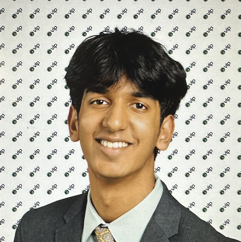

---
---

<link rel="stylesheet" href="styles.css">

    <!-- Sidebar -->
    

        <!-- Profile picture (me.png) -->
        
        <h2>Dhruv Malladi</h2>
        
Welcome to my personal website! To make it clear, I am not the best coder by any means. Please email me at dmalladi35@gmail.com if you have any concerns!

    

   

My name is **Dhruv Malladi**, and I'm currently a senior in high school. I live in Illinois and have several passions, ranging from squash, exploring nature on hikes, and learning more about my culture. This website is mainly an outlet for my anthropology work, which you will find on the anthropology page.

My passion for studying anthropology came in many ways. From a young age, I was always somewhat distant from my culture. Over time, I began to realize the importance of studying culture in this large world we live in. Whether it was going through Manabadi school, or taking history classes that helped shape my worldview, I now understand culture is the underlying factor that makes us unique as individuals. 

On the topic of culture, cultural identities also look different for everyone. While I was born in America, my parents are Telugu. Being a Telugu-American comes with its hardships but also its positives. I am constantly striving to learn more about Telugu, and hopefully about myself as well.

If you are here, I'm assuming I probably gave you the link to my website. Either way, thank you so much for coming to learn a little more about me! please don't hesitate to reach out to me if you have any questions.

